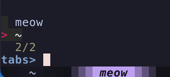

# Kitty-Meow

Meow is a kitty terminal extension for working with projects, where each kitty tab is a different
project. It allows you to fuzzy switch between projects, and load them either from local directories or github.

If you've used tmux, this is similar to switching between sessions, but allows you to
create new sessions as well.



## Usage

[1-minute demo](https://www.youtube.com/watch?v=Qm8Xl4GAylI)

Call your project mapping, e.g. ctrl-space, and hit enter to select. Initially, tabs & local projects
are listed, but you can show remote, local project only, or tabs only.

On select

- if the project is already in a tab, meow switches to that tab
- if the project is a local dir, meow creates a new tab
- if the project is github, meow clones to the first --dir, and creates a new tab

## Installation

```sh
git clone git@github.com:taylorzr/kitty-meow.git ~/.config/kitty/meow
```

Requires [fzf](https://github.com/junegunn/fzf/) and tac (provided by coreutils).

## Getting Started

You'll need to:

- create mappings
- set your github token as env

For example:

```conf
# ~/.config/kitty/kitty.conf

env GITHUB_TOKEN=<github_token>
env BIN_PATH=/opt/homebrew/bin/ # probably only needed on macs

map ctrl+space kitten meow/projects.py load --dir $HOME/code/ --dir $HOME --dir $HOME/.config/kitty/meow --user taylorzr
map ctrl+- goto_tab -1
map ctrl+shift+n kitten meow/projects.py new --dir $HOME/code/
map ctrl+shift+g kitten meow/cache.py --org AquaTeenHungerForce
map ctrl+shift+x kitten meow/kill.py
```

## Kitty Mappings

#### Loading projects

Create a mapping for loading projects. The pattern is:

```conf
# ~/.config/kitty/kitty.conf

map ctrl+p kitten meow/project.py load --dir $HOME/code/ --user <you> --org <github_org>
```

--dir can be provided multiple times.

- when a dir ends in /, meow shows all it's subdirs
- otherwise, meow only shows that specific dir
- remote repos are cloned into the first --dir

For example, I use:

```conf
# ~/.config/kitty/kitty.conf

map ctrl+p kitten meow/project.py load --dir $HOME/code/ --dir $HOME --dir $HOME/.config/kitty/meow --org my_cool_org
```

On mac, paths are goofy. You proabably need to set env BIN_PATH as well. This should be the dir
containing and fzf.

```conf
# ~/.config/kitty/kitty.conf

env BIN_PATH=/opt/homebrew/bin/
```

#### Caching github repositories

If you work in an org with lots of repos, loading remote projects can be slow. You can create a
binding that will cache all the repos for orgs. This is a manual process, just run it whenever you
need to update the list of projects for an org.

```conf
map ctrl+shift+g kitten meow/cache.py --org my_cool_org
```

Just like the projects.py load mapping, you can specify multiple users and orgs in your cache mapping.
You might want these to be different than users and orgs in your projects.py load mapping, because an
org might have lots of repos, but your user just a few. Any uncached users/orgs repos will be
loaded from github on every call to projects.py load. And the cache never expires, you must call
cache.py to refresh it.

## Github Auth

You need to create a github token, and set it as env GITHUB_TOKEN. Because I commit kitty.conf to my
dotfiles, I put any secrets in an extra conf file:

```conf
# ~/.config/kitty/kitty.conf

include ./dont_commit_me.conf
```

```conf
# ~/.config/kitty/dont_commit_me.conf

env GITHUB_TOKEN=<github_token>
```

You need to put env in your kitty config, not .zshrc. More about that [here](https://sw.kovidgoyal.net/kitty/faq/#things-behave-differently-when-running-kitty-from-system-launcher-vs-from-another-terminal)

## TODO

- configurable fzf bindings
- selectable dir to clone to?
  - some people might use 1 dir for work and one for personal?
- maybe use flags like --login=user=taylorzr --login=org=my_cool_org
- combine the scripts into one cli with subcommands
  - we could then have a fzf binding for loading new projects from the normal project selection
- caching all repos should remove unknown files, e.g. i stop caching taylorzr, i need to delete cache_taylorzr
