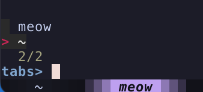

# Kitty-Meow

Meow is a kitty terminal tool for working with projects, where each kitty tab is a different
project. It allows you to fuzzy switch between projects, and load them either from local directories or github.

If you've used tmux, this is similar to switching between sessions, but allows you to
easily create new sessions as well.



## Basic Usage

[1-minute demo](https://www.youtube.com/watch?v=Qm8Xl4GAylI)

Call your switch mapping, e.g. ctrl-space, type to filter, and hit enter to select. Initially, tabs
& local projects are listed, but you can show only remote, or local, or open.


On select

- if the project is already in a tab, meow switches to that tab
- if the project is a local dir, meow creates a new tab
- if the project is github, meow clones to the first --dir, and creates a new tab


## Getting Started

### Installation

```sh
go install github.com/taylorzr/kitty-meow@latest
```

Requires [fzf](https://github.com/junegunn/fzf/).

### Configuration

You'll need to:

- configure ~/.config/kitty/meow/config.toml
- update ~/.config/kitty/kitty.conf
  - set your github token as env
  - create keyboard shortcut for switching

### config.toml

Set at least dirs and github. More options can be seen in config.example.toml.

```toml
# ~/.config/kitty/meow/config.toml

dirs  = [
  "~/code/",
  "~/.config/kitty/meow",
]

[[github]]
owner = somecoolguy
```

### kitty.conf

```conf
# ~/.config/kitty/kitty.conf

env GITHUB_TOKEN=<github_token>
map ctrl+space kitty-meow switch
map ctrl+- goto_tab -1

# optional: keeps tab title set to project name
map ctrl+enter launch --cwd=current --title=current
window_title_format {tab.title}
```

## Caching github repositories

If you work in an org with lots of repos, listing remote projects can be very slow. So you can
cache the list with `kitty-meow cache <owner>` e.g. `kitty-meow cache taylorzr`.

- list the current caches with `kitty-meow cache --list`
- refresh all the caches with `kitty-meow cache`
- refresh a specific with `kitty-meow cache <owner>`
- delete a cache with `kitty-meow cache --remove <owner>`

Caches aren't automatically updated, so re-run `kitty-meow cache` as needed.

## Github Auth

You need to create a github token with , and set it as env GITHUB_TOKEN. You need to put env in your kitty
config, not .zshrc. More about that
[here](https://sw.kovidgoyal.net/kitty/faq/#things-behave-differently-when-running-kitty-from-system-launcher-vs-from-another-terminal)

Because I commit kitty.conf to my dotfiles, I put any secrets in an extra conf file:

```conf
# ~/.config/kitty/kitty.conf

include ./dont_commit_me.conf
```

```conf
# ~/.config/kitty/dont_commit_me.conf

env GITHUB_TOKEN=<github_token>
```

## Experimental Wezterm Support

Added support for wezterm in addition to kitty. This is very much experimental, and may be removed in the future.

```lua
# ~/.config/wezterm/wezterm.lua

local wezterm = require 'wezterm'
local config = wezterm.config_builder()

config.default_prog = { 'zsh' }

config.keys = {
  {
    key = 'Space',
    mods = 'CTRL',
    action = wezterm.action.SplitPane {
      direction = 'Down',
      command = { args = { os.getenv("HOME") .. '/go/bin/kitty-meow', 'switch' } },
    },
  }
}

return config
```

## TODO

- show only project name in title
^
- cmds to go out/in of projects like vim ctrl-o/i, maybe ctrl-shift-o/i?
- project based templates
  - run editor | shell | server like go run .
- support other git sources, like gitlab
