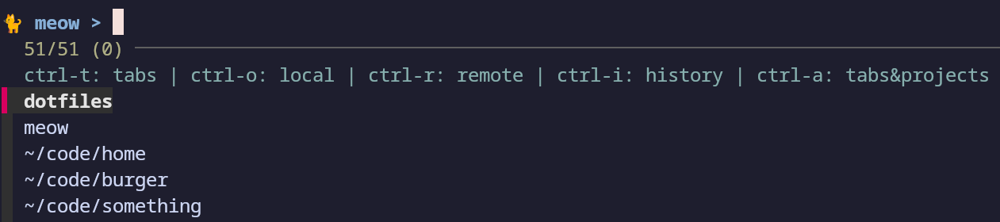

# Kitty-Meow

Meow is a kitty terminal extension for working with projects. It allows you to easily switch between
projects, and load them either from local directories or github.

If you've used tmux sessions. This is similar to switching between sessions, but allows you to
create new sessions as well.



## Installation

```sh
git clone git@github.com:taylorzr/kitty-meow.git ~/.config/kitty/meow
```

Depends on [fzf](https://github.com/junegunn/fzf/) and [jq](https://github.com/stedolan/jq).

## Getting Started

You'll need to:

* create mapping for loading projects
* set your github token as env

For example:

```conf
# ~/.config/kitty/kitty.conf

env GITHUB_TOKEN=<github_token>
env BIN_PATH=/opt/homebrew/bin/ # probably only needed on macs
map ctrl+space kitten meow/load_project.py --dir $HOME/code/ --org my_cool_org
map ctrl+- goto_tab -1
```

### kitty mapping

Create a mapping for loading projects. The pattern is:

```conf
# ~/.config/kitty/kitty.conf

map ctrl+space kitten meow/load_project.py --dir $HOME/code/ ---org <github_org>
```

--dir can be provided multiple times.

* when a dir ends in /, meow shows all it's subdirs
* otherwise, meow only shows that specific dir

For example, I use:

```conf
# ~/.config/kitty/kitty.conf

map ctrl+space kitten meow/load_project.py --dir $HOME/code/ --dir $HOME --dir $HOME/.config/kitty/meow --org my_cool_org
```

On mac, paths are goofy. You proabably need to set env BIN_PATH as well. This should be the dir
containing and fzf.

```conf
# ~/.config/kitty/kitty.conf

env BIN_PATH=/opt/homebrew/bin/
```

### github auth

You need to create a github token, and set it as env GITHUB_TOKEN. Because I commit kitty.conf to my
dotfiles, I put any secrets in an extra conf file:

```conf
# ~/.config/kitty/kitty.conf

include ./dont_commit_me.conf
```

```conf
# ~/.config/kitty/dont_commit_me.conf

env GITHUB_TOKEN=<github_token>
```

You need to put env in your kitty config, not .zshrc. More about that [here](https://sw.kovidgoyal.net/kitty/faq/#things-behave-differently-when-running-kitty-from-system-launcher-vs-from-another-terminal)

## Usage

Call your mapping, e.g. ctrl-space

* current tabs show initially
* ctrl-r shows all your local directories
* ctrl-g shows all your github repos
* enter selects an item

On select

* if the project is already in a tab, meow switches to that tab
* if the project is a local dir, meow creates a new tab
* if the project is github, meow clones to the first --dir, and creates a new tab

## TODO

* record short video demo
* get_all_repos should get curent users repos
* get_all_repos should allow multiple orgs, or maybe even none
* caching for big orgs
  see what [this dude did](https://mattorb.com/fuzzy-find-a-github-repository-part-deux/)
* configurable fzf bindings (i.e. currently ctrl-r and ctrl-g)
* selectable dir to clone to?
  * some people might use 1 dir for work and one for personal?
